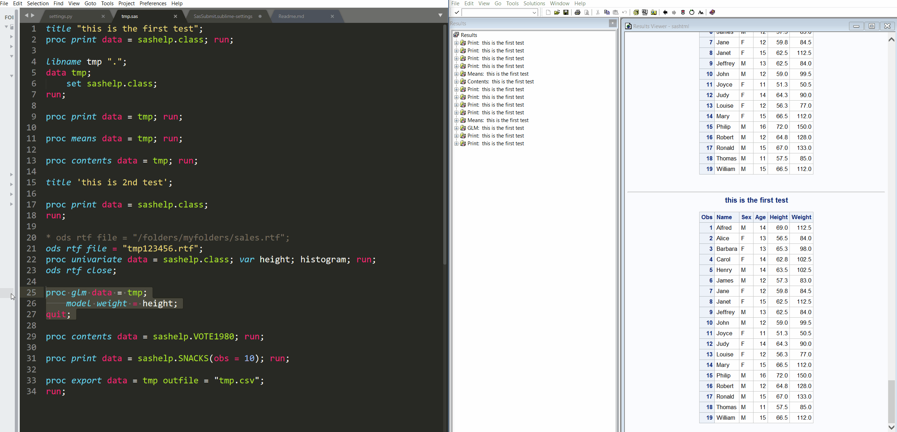
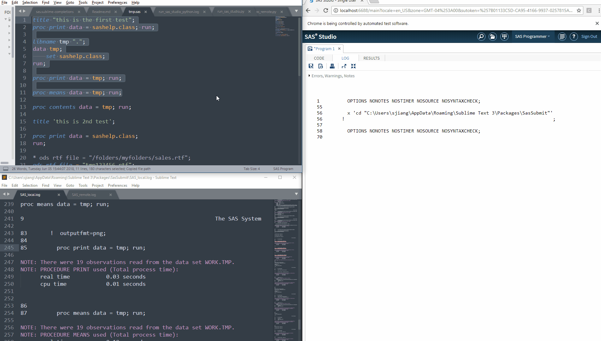

# Descriptions
This program currently supports submitting SAS command in:
* **'classic' mode**: Running SAS program in the classic SAS window
    
* **'studio' mode**: Submitting SAS command to SAS studio running in browser
    
* **'studio_ue' mode**: Submitting SAS command to SAS studio university edition running in browser

Only Windows operating system is supported at this moment. Supports for macos will be added in the future.

# Installation
Download this package and put into Sublime "packages\\" folder or install it using Sublime package control. The latest version of Google Chrome browser needs to be installed. The Sublime packge [`SAS Programming`](https://github.com/rpardee/sas) need to be installed prior to this package.

## Basic setup
* Make a copy of the SasSubmit.sublime-settings and put it into Sublime "Packages/User/" folder. Make changes only to the user settings.

## Classic mode
* In settings change `loading_time` to the estimated time for SAS to start up (normally 2-5 seconds depends on your hardare). 
* Configure SAS, this only need to be done once.
    - Change the shortcuts in SAS to be:
        + F1: gsubmit buf = default
        + F5: wpgm
        + F7: output 
    - You can do it manually: 
        + Open SAS, in the command box in the top left of SAS program, type in `keys` and press `Enter`
        

          
        

        + This will open a "KEYS <DMKEYS>" window, make the changes.
        

          
        

    - Or you can copy the `profile.sas7bcat` file in the `SasSubmit` folder and put it into your `SASUSER` folder (typically it's located at `%USERPROFILE%\Documents\My SAS Files\9.4`). Before replacing it, it's recommended to make a backup of your previous `profile.sas7bcat` file.

## SAS studio university edition
* Start SAS studio university edition.

* Open the link [http://localhost:10080](http://localhost:10080) in your browser
* Click on the link to start SAS studio.
* The link changes to the format like "http://localhost:10080/SASStudio/371/". Change the settings `studio_address_ue` to this link because it directly link to your SAS studio.
* If you prefer using a browser other than Chrome, you can change the settings `browser` to be either "ie" (Internet explorer) or "firefox" (Firefox). Before you do that, make sure you download the compatible webdriver executable and put it into the `SasSubmit\binaries` folder. For 'ie', it can be downloaded from [here](http://selenium-release.storage.googleapis.com/3.9/IEDriverServer_Win32_3.9.0.zip) if you are using 32 bit IE, or [here](http://selenium-release.storage.googleapis.com/3.9/IEDriverServer_x64_3.9.0.zip) if you are using 64 bit IE. For 'firefox', it can be downloaded from [here](https://github.com/mozilla/geckodriver/releases). You need unzip the downloaded file first and put only the `.zip` file into the `binary` folder.

## SAS studio
* Start SAS studio installed with SAS 9.4. It should open a page in your browser. The link of the web page is in the format of `http://localhost:####/?sutoken=***************************************`, where `####` is a port number and `***************************************` is the token of you SAS studio. Change `studio_address` in settings to be this link.
* SAS studio do not need to be installed on your local computer. You can remotely connect to a computer running SAS studio via port forwarding.

# Usage
* Open command Platte and type in `create session`. 
* On the lower screen find the "Session to Create:" box, and type in the session you want to create. "studio", "studio_ue", "classic" stands for SAS studio, SAS studio university edition, classic SAS. If you type anything else it would fail.
* Wait for the session to be created. 
* When the session is ready submit code using `F3`.
* Keep your Sublime application running, otherwise all the sessions would be closed. Also keep the Chrome window open by the session open, otherwise that session would be killed.
* You can create multiple sessions, and you can also switch to different sessions by opening command Platte and type in "choose session".

# Debug
This plugin is still in the alpha stage and I haven't tested thoroughly. If you have problem such as session cannot be created or submitting does not work, please first read Sublime "Packages/SasSubmit/SasSubmit.log"or submit an issue. 
Push is welcome!